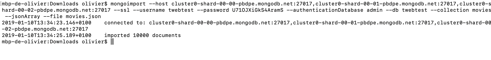

### 1. Importer une collection de films (0.5pt)

### 2. Liste des films (3pt)

http://localhost:9000/api/movies

Pagination: http://localhost:9000/api/movies/2/10 avec comme params dans l'ordre page et limit

